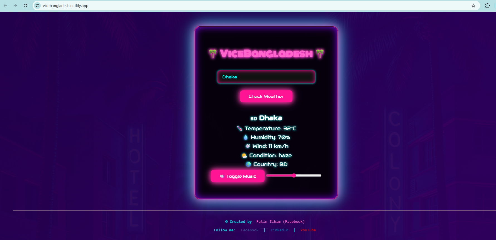
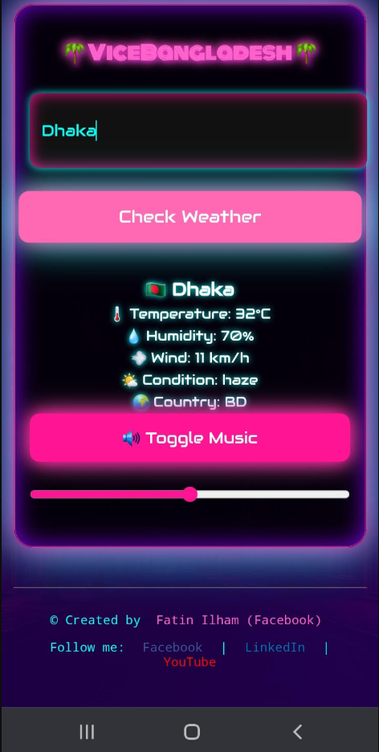

# 🌴 ViceBangladesh Weather App

A neon-styled weather application with Vice City aesthetics, featuring real-time weather data and background music.

## ✨ Features

- **Real-time Weather** - Current temperature, humidity, wind speed, and conditions
- **Worldwide Cities** - Search any city globally (not just Bangladesh)
- **Neon UI** - Retro Vice City inspired design with animated gradients
- **Background Music** - Toggleable GTA Vice City soundtrack
- **Volume Control** - Adjustable music volume slider
- **Mobile Responsive** - Optimized for phones and tablets
- **API Key Hidden** - Serverless function protects API credentials

## 📸 Screenshots

### Desktop View


### Mobile View


> **Note**: Add your screenshots to the `screenshots/` folder:
> 1. Open the app in browser
> 2. Press `F12` → Device Toolbar → Test mobile view
> 3. Take screenshots and save as `desktop.png` and `mobile.png`

## 🛠️ Tech Stack

- **Frontend**: HTML, CSS, JavaScript (Vanilla)
- **Backend**: Netlify Serverless Functions
- **Weather API**: OpenWeatherMap
- **Hosting**: Netlify (auto-deploy from GitHub)

## 🚀 How It Works

```
┌─────────────┐     ┌──────────────────┐     ┌──────────────────┐
│   Browser   │────▶│  Netlify Edge    │────▶│  OpenWeatherMap  │
│  (Frontend) │     │  (Serverless)    │     │      API         │
└─────────────┘     └──────────────────┘     └──────────────────┘
       │                      │
       │ 1. Fetch weather     │ 2. Add API key
       │    (city name)       │    (hidden from user)
       │                      │ 3. Return data
       ◀──────────────────────┘
```

1. User enters city name
2. Frontend calls `/.netlify/functions/weather?city=X`
3. Netlify function adds API key server-side
4. OpenWeatherMap returns weather data
5. Function forwards data to frontend
6. UI displays weather with neon styling

## 📁 Project Structure

```
vcweatherapp/
├── index.html              # Main HTML page
├── style.css               # Neon styling + responsive CSS
├── script.js               # Weather fetch + UI logic
├── GTAVC.mp3               # Background music
├── background.jpg          # Background image overlay
├── .env                    # Environment variables (local dev)
├── .env.example            # Example env file
├── .gitignore              # Git ignore rules
├── netlify.toml            # Netlify config
└── netlify/
    └── functions/
        └── weather.js      # Serverless function (hides API key)
```

## 🏃 Local Development

### Prerequisites
- Node.js 18+ (for `fetch` API)
- Netlify CLI (optional)

### Setup

1. **Clone repo**
   ```bash
   git clone https://github.com/fatin-ilham/vcweatherapp.git
   cd vcweatherapp
   ```

2. **Create `.env` file**
   ```bash
   OPENWEATHER_API_KEY=your_api_key_here
   ```

3. **Run locally**
   
   Option A: Simple HTTP server
   ```bash
   npx http-server -p 8080
   ```
   Visit `http://localhost:8080`

   Option B: Netlify CLI (tests serverless functions)
   ```bash
   npm install -g netlify-cli
   netlify dev
   ```
   Visit `http://localhost:8888`

## 🌐 Deploy to Netlify

### Method 1: Auto-deploy (Recommended)

1. Go to [Netlify](https://netlify.com)
2. Click **"Add new site"** → **"Import an existing project"**
3. Connect GitHub account
4. Select repo: `fatin-ilham/vcweatherapp`
5. Branch: `main` or `weather-app-improvements`
6. Build settings:
   - **Publish directory**: `/` (root)
   - **Functions directory**: `netlify/functions`
7. Click **"Deploy site"**

### Set Environment Variable

1. Go to **Site settings** → **Environment variables**
2. Add variable:
   - **Key**: `OPENWEATHER_API_KEY`
   - **Value**: `30b2d59ea021e3f1c416bd1d896ffc98`
3. Redeploy

### Method 2: Manual Deploy

```bash
npm install -g netlify-cli
netlify login
netlify deploy --prod
```

## 🎨 Customization

### Change Music
Replace `GTAVC.mp3` with any audio file. Update in `index.html`:
```html
<source src="your-music.mp3" type="audio/mpeg" />
```

### Change Colors
Edit CSS variables in `style.css`:
```css
--primary: #ff1493;  /* Pink */
--secondary: #00fff7; /* Cyan */
```

### Change API Key
Get free key from [OpenWeatherMap](https://openweathermap.org/api)
Update in `.env` and Netlify environment variables.

## 📱 Mobile Optimization

- **Touch-friendly**: 48px+ buttons
- **Responsive**: Breakpoints at 768px and 480px
- **iOS fix**: 16px input font (prevents zoom)
- **Full width**: Inputs/buttons expand on small screens

## 🔒 Security

- ✅ API key hidden in serverless function
- ✅ `.env` file in `.gitignore`
- ✅ CORS enabled for frontend access
- ⚠️ Don't commit `.env` to GitHub

## 🐛 Known Issues

- **Music autoplay blocked**: Browsers block autoplay. User must click toggle first.
- **API key in frontend (old code)**: Fixed in latest version with serverless function.

## 📄 License

Free to use. Created by Fatin Ilham.

## 🔗 Links

- [Facebook](https://www.facebook.com/spiritofhonestyy/)
- [LinkedIn](https://www.linkedin.com/in/fatin-ilham-67b806331/)
- [YouTube](https://www.youtube.com/@tonizer6151)
